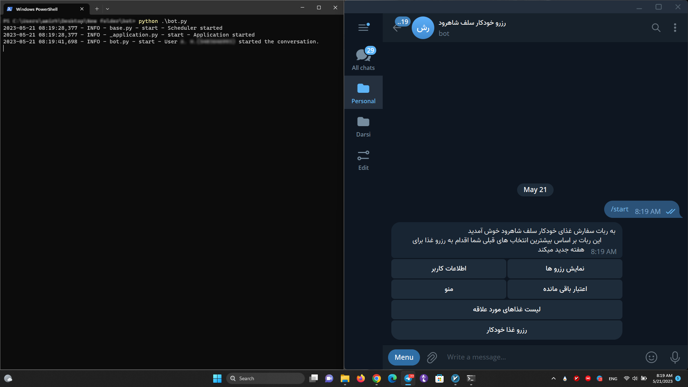
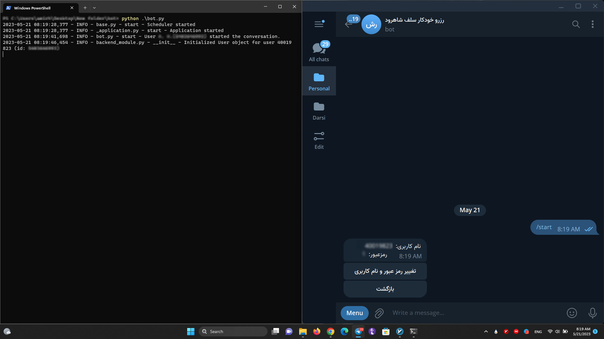
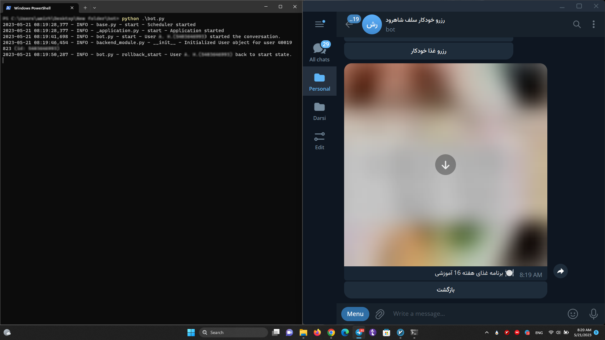
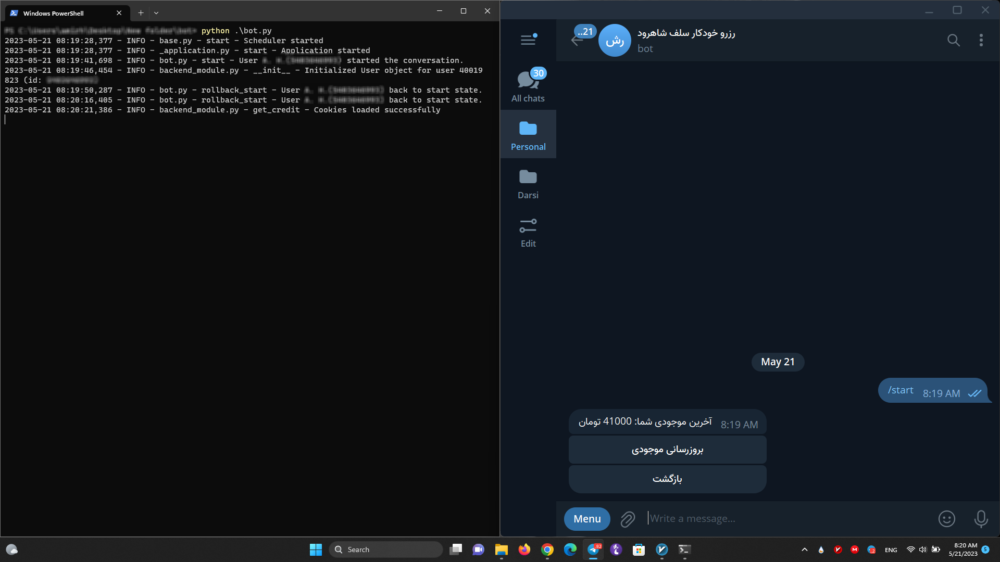
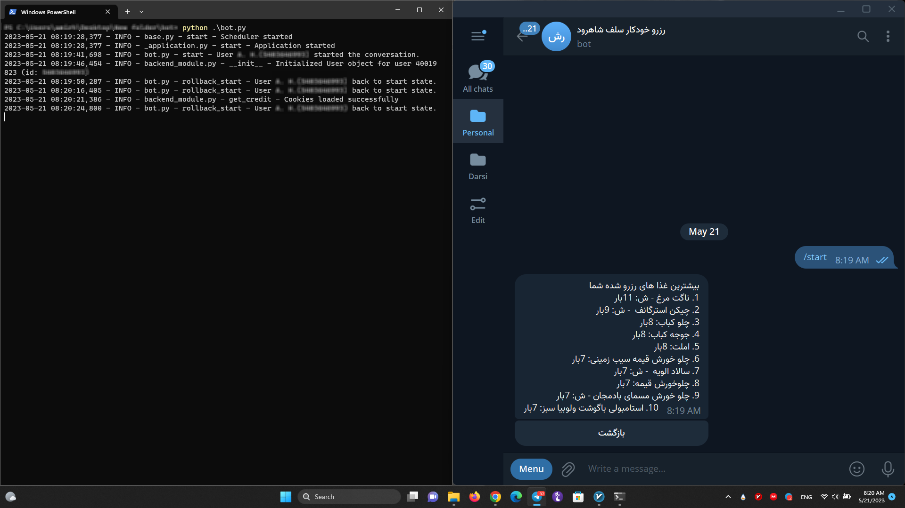
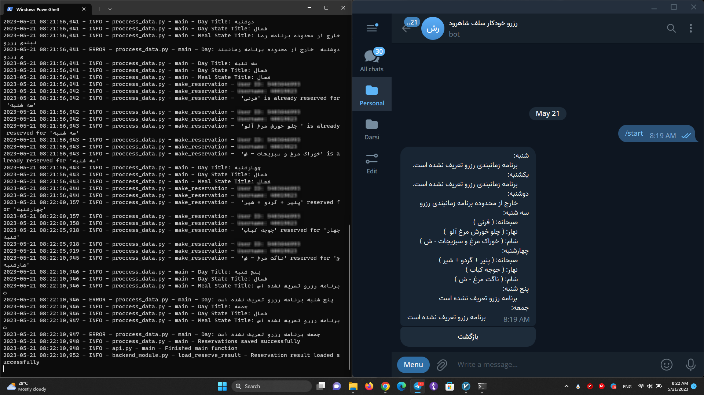

# Automatic Food Ordering Bot
Self-Reservation Tool for Shahrood University of Technology
This repository contains the code for an automatic food ordering bot built using the Telegram Bot API. The bot allows users to register, update their account information, view their reserved meals, check their remaining credit, and perform other related actions.

## Purpose
This tool allows students of Shahrood University of Technology to make meal reservations at the Self cafeteria automatically.

## Prerequisites
* Python 3.7 or above
* `python-telegram-bot` library
* `beautifulsoup4`
* `jdatetime`
* `Requests`
* `selenium`
* `Unidecode`

## Getting Started
1. Clone this repository:
```
git clone https://github.com/Warm-Hearted-Snowman/Predict_Car_Price_with_MachineLearning
```
2. Install the required dependencies:
```
pip install -r requirements.txt
```
3. Obtain a Telegram Bot API token. You can create a new bot and obtain the token from [BotFather](https://core.telegram.org/bots#botfather).

4. Replace the placeholder `TOKEN` with your Telegram Bot API token in the code:
```
# Replace 'TOKEN' with your Telegram Bot API token
bot = Application(TOKEN)
```
5. Run the bot:
```
python main.py
```
## Usage
Once the bot is up and running, you can interact with it through a Telegram chat. Here are the available commands and functionalities:
* /start - Start the conversation with the bot.
* Add User - Register a new user account.
* Update User Info - Update the username and password for an existing user.
* User Info - View the user's username and password.
* Reserved - View the reserved meals.
* Menu - View the menu.
* Credit - Check the remaining credit.
* Update Credit - Update the credit balance.

## Database Operations
The backend module provides functionality for creating and managing a SQLite database. The following functions are available:
* create_connection(db_file): Creates a database connection to the SQLite database specified by db_file.
* create_table(conn, create_table_sql): Creates a table in the database using the provided SQL statement.
* create_tables(conn=None): Creates the necessary tables in the database if they don't already exist.
* insert_cookies(request_verification_token, jahangostar_setare, user, conn=None): Inserts cookies into the cookie table in the database for a given user.
* insert_credit(user_id, credit, conn=None): Inserts credit into the credit table in the database for a given user.
* get_cookies(user, conn=None): Retrieves cookies for a given user from the database.
* get_reserved_foods(user_id): Retrieves reserved foods for a given user.

For detailed usage instructions and examples, refer to the code comments and documentation within the backend module.

## ScreenShots









## Contributing
Contributions to this project are welcome. If you find any issues or have suggestions for improvements, please open an issue or submit a pull request.

## License
This project is licensed under the [MIT License](https://www.mit.edu/~amini/LICENSE.md).